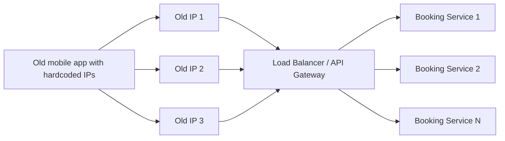
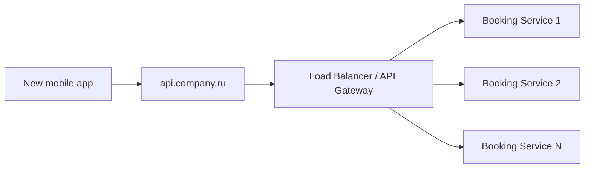
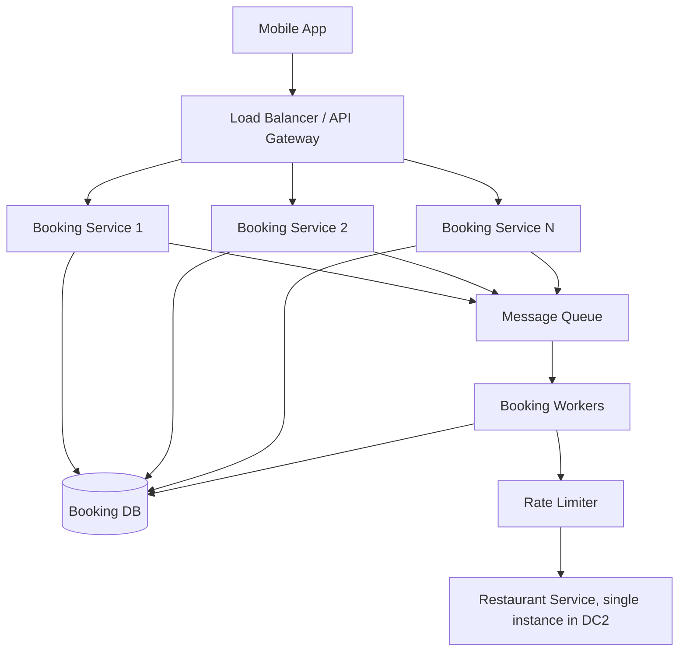
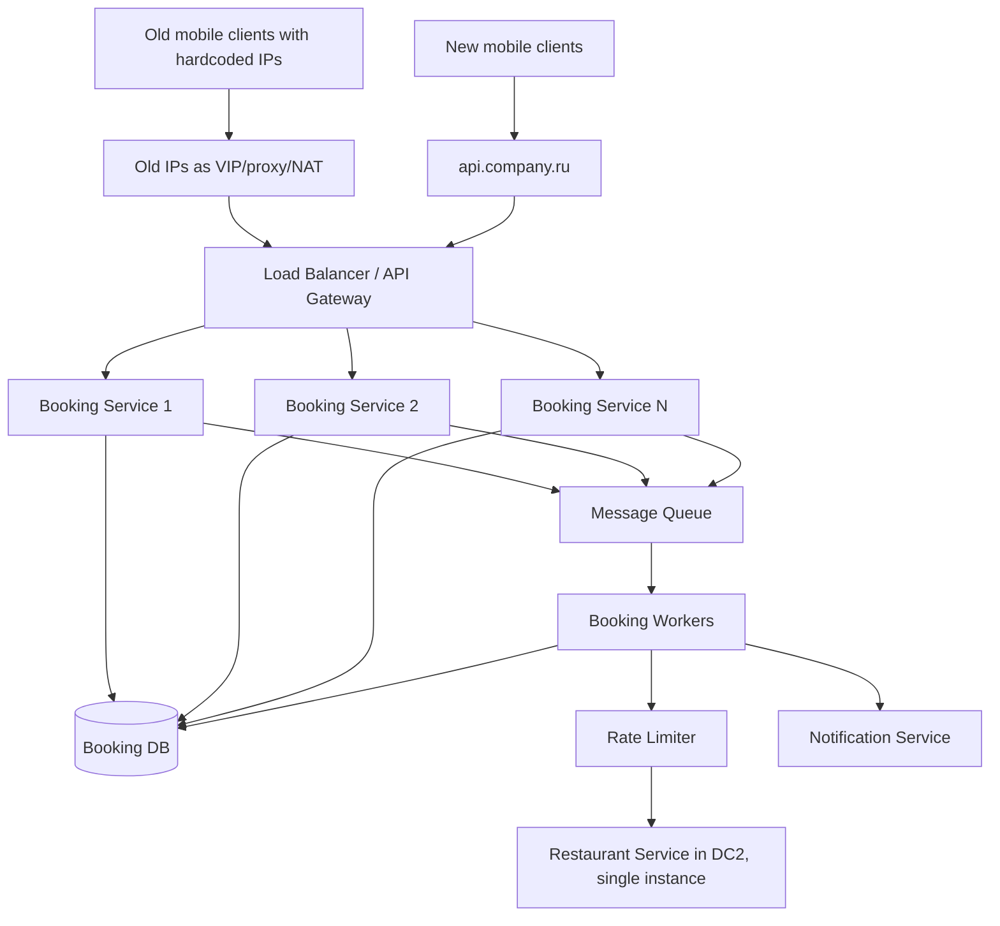
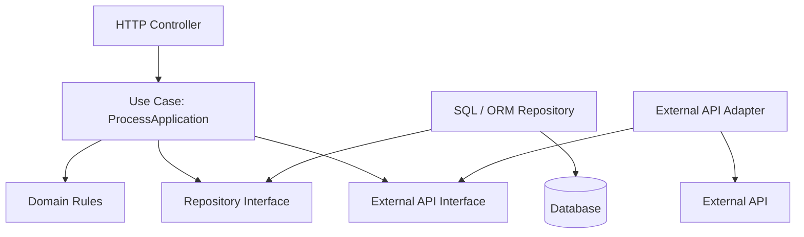
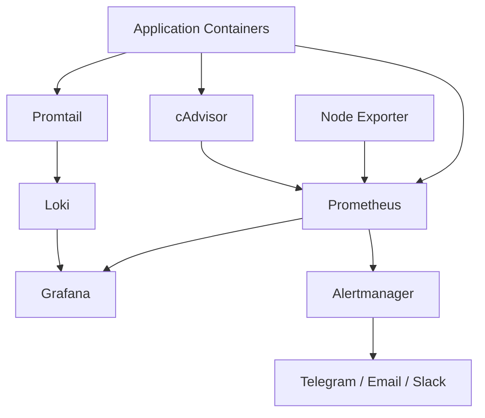

# Экзаменационная работа
## Архитектура сервисов и приложений
### Модуль 2. Архитектурные стили и паттерны

---

# Задание 1. Реорганизация системы управления онлайн-курсами

## Краткий анализ исходной системы

В исходной реализации система управления онлайн-курсами построена вокруг класса `CourseManager`. Этот класс выполняет слишком много разнородных обязанностей: создает курсы разных типов, хранит данные о курсах и пользователях, регистрирует студентов, рассчитывает итоговые оценки, отправляет уведомления и напрямую вызывает внешний платежный API.

Такая структура нарушает принцип единственной ответственности. У класса появляется слишком много причин для изменения. Добавление нового типа курса, изменение алгоритма оценивания, подключение нового канала уведомлений или смена платежного провайдера требуют изменения одного и того же класса.

Основные проблемы исходной архитектуры:

1. **Перегруженность `CourseManager`.** В одном классе находятся создание курсов, бизнес-логика, хранение данных, уведомления и платежи.
2. **Жесткое создание объектов.** Курсы создаются через условные конструкции и прямые вызовы конструкторов:

   ```text
   if (type == "online") new OnlineCourse(...)
   else if (type == "offline") new OfflineCourse(...)
   ```

3. **Не выделен слой хранения данных.** В условии указано, что `CourseManager` хранит данные о курсах и пользователях. Это смешивает бизнес-логику и работу с данными.
4. **Жестко зафиксирован алгоритм расчета оценки.** Один алгоритм применяется ко всем курсам, хотя правила оценивания могут отличаться.
5. **Уведомления встроены в бизнес-логику.** Вызовы вроде `sendEmail(...)` находятся прямо внутри методов.
6. **Прямая зависимость от внешнего платежного API.** Бизнес-логика зависит от конкретной внешней системы.
7. **Дублирование логики.** Похожие проверки и действия могут повторяться в разных методах.

Вывод: исходная система плохо расширяется, сложно тестируется и нарушает DRY, KISS и разделение ответственности.

---

## Предлагаемая новая структура

В новой архитектуре `CourseManager` заменяется набором компонентов с отдельными зонами ответственности:

- `CourseService` – координирует основные бизнес-сценарии;
- `CourseFactory` – создает объекты курсов;
- `CourseRepository`, `UserRepository`, `EnrollmentRepository`, `GradeRepository`, `PaymentRepository` – отвечают за хранение данных;
- `GradeCalculationStrategy` – задает алгоритм расчета оценки;
- `CourseEventPublisher` – публикует события системы;
- `NotificationObserver` – реагирует на события и отправляет уведомления;
- `PaymentService` – внутренний интерфейс оплаты;
- `ExternalPaymentAdapter` – адаптер к внешнему платежному API;
- `Command` – инкапсулирует отдельные операции.

Главная идея – бизнес-логика работает с интерфейсами, а не с конкретными классами и внешними API.

---

## Слои архитектуры

### Прикладной слой

`CourseService` выполняет сценарии приложения: создание курса, регистрация студента, расчет оценки, запуск оплаты. Он не хранит данные самостоятельно, не создает курсы через `new`, не отправляет уведомления напрямую и не вызывает внешний платежный API.

### Доменный слой

В доменном слое находятся основные сущности:

- `Course`;
- `OnlineCourse`;
- `OfflineCourse`;
- `HybridCourse`;
- `User`;
- `Student`;
- `Enrollment`;
- `Grade`;
- `Payment`.

Этот слой описывает предметную область и не зависит от SQL, ORM, HTTP, email или внешних сервисов.

### Слой хранения данных

Слой хранения данных нужно выделить явно, чтобы данные о курсах и пользователях не хранились внутри `CourseManager`.

Предлагаемые репозитории:

| Репозиторий | Ответственность |
|---|---|
| `CourseRepository` | Хранение и получение курсов |
| `UserRepository` | Хранение и получение пользователей |
| `EnrollmentRepository` | Хранение записей студентов на курсы |
| `GradeRepository` | Хранение оценок и результатов |
| `PaymentRepository` | Хранение платежей и их статусов |

`CourseService` работает только с интерфейсами репозиториев. Конкретные SQL/ORM-реализации, например `SqlCourseRepository`, находятся в инфраструктурном слое.

```text
CourseService -> CourseRepository interface -> SqlCourseRepository -> Database
```

Такой подход позволяет менять базу данных, ORM или SQL-запросы без изменения основной бизнес-логики.

### Инфраструктурный слой

В инфраструктурном слое находятся:

- SQL/ORM-репозитории;
- адаптер платежной системы;
- реализации email/SMS/Telegram-уведомлений;
- интеграции с внешними сервисами.

---

## Диаграмма классов

```mermaid
classDiagram
    class CourseService {
        +createCourse(type, data)
        +registerStudent(courseId, userId)
        +calculateFinalGrade(courseId, userId)
        +payForCourse(courseId, userId)
    }

    class Course {
        <<abstract>>
        +id
        +title
        +price
    }

    class OnlineCourse
    class OfflineCourse
    class HybridCourse

    class CourseFactory {
        <<interface>>
        +createCourse(type, data) Course
    }

    class CourseRepository {
        <<interface>>
        +save(course)
        +findById(id)
    }

    class UserRepository {
        <<interface>>
        +save(user)
        +findById(id)
    }

    class EnrollmentRepository {
        <<interface>>
        +save(enrollment)
    }

    class GradeRepository {
        <<interface>>
        +save(grade)
    }

    class PaymentRepository {
        <<interface>>
        +save(payment)
    }

    class GradeCalculationStrategy {
        <<interface>>
        +calculate(student, course) Grade
    }

    class PaymentService {
        <<interface>>
        +pay(request) PaymentResult
    }

    class ExternalPaymentAdapter
    class ExternalPaymentApi

    class CourseEventPublisher
    class NotificationObserver {
        <<interface>>
        +handle(event)
    }

    class EmailNotificationObserver
    class SmsNotificationObserver
    class TelegramNotificationObserver

    class Command {
        <<interface>>
        +execute()
    }

    CourseService --> CourseFactory
    CourseService --> CourseRepository
    CourseService --> UserRepository
    CourseService --> EnrollmentRepository
    CourseService --> GradeRepository
    CourseService --> PaymentRepository
    CourseService --> GradeCalculationStrategy
    CourseService --> PaymentService
    CourseService --> CourseEventPublisher

    OnlineCourse --|> Course
    OfflineCourse --|> Course
    HybridCourse --|> Course

    ExternalPaymentAdapter ..|> PaymentService
    ExternalPaymentAdapter --> ExternalPaymentApi

    CourseEventPublisher --> NotificationObserver
    EmailNotificationObserver ..|> NotificationObserver
    SmsNotificationObserver ..|> NotificationObserver
    TelegramNotificationObserver ..|> NotificationObserver
```



---

## Используемые паттерны проектирования

### Factory Method

**Где используется:** в `CourseFactory`.

**Задача:** вынести создание курсов из `CourseService`.

**Что решает:** бизнес-логика больше не содержит `if/else` с прямыми вызовами `new OnlineCourse(...)`. При добавлении нового типа курса не нужно переписывать основной сервис.

### Strategy

**Где используется:** в `GradeCalculationStrategy`.

**Задача:** вынести алгоритм расчета оценки в отдельные реализации, например `DefaultGradeStrategy`, `ExamGradeStrategy`, `ProjectGradeStrategy`.

**Что решает:** разные курсы могут использовать разные правила оценивания без изменения `CourseService`.

### Observer

**Где используется:** в связке `CourseEventPublisher` и `NotificationObserver`.

**Задача:** отделить бизнес-события от уведомлений.

**Что решает:** `CourseService` публикует событие, например `StudentRegistered`, а подписчики сами отправляют email, SMS или Telegram. Новый канал уведомлений добавляется без изменения бизнес-логики.

### Adapter

**Где используется:** в `ExternalPaymentAdapter`.

**Задача:** изолировать внешний платежный API от внутренней бизнес-логики.

**Что решает:** при смене платежного провайдера нужно заменить адаптер, а не переписывать `CourseService`.

### Command

**Где используется:** в командах `CreateCourseCommand`, `RegisterStudentCommand`, `PayCourseCommand`.

**Задача:** инкапсулировать отдельные операции.

**Что решает:** повторяющиеся сценарии можно переиспользовать, логировать, запускать отложенно или выполнять единообразно. Это снижает дублирование.

---

## Соответствие проблем и решений

| Проблема | Решение | Паттерн / принцип | Обоснование |
|---|---|---|---|
| `CourseManager` выполняет слишком много обязанностей | Разделить систему на сервисы, фабрики, стратегии, репозитории, уведомления и адаптер оплаты | SRP | Каждый компонент получает отдельную ответственность |
| `CourseManager` хранит курсы и пользователей | Вынести хранение в слой репозиториев | Repository, DIP | Бизнес-логика зависит от интерфейсов, а не от БД |
| Не продумано хранение записей, оценок и платежей | Добавить `EnrollmentRepository`, `GradeRepository`, `PaymentRepository` | Repository | Разные типы данных хранятся через отдельные интерфейсы |
| Создание курсов через `if/else` | Использовать `CourseFactory` | Factory Method | Создание объектов отделяется от бизнес-логики |
| Новый тип курса требует изменения существующего кода | Добавлять новый класс курса и фабричную реализацию | OCP, Factory Method | Система расширяется без переписывания основной логики |
| Алгоритм оценки жестко зафиксирован | Ввести стратегии расчета оценки | Strategy | Алгоритмы можно менять независимо |
| Уведомления встроены в бизнес-логику | Использовать события и наблюдателей | Observer | Бизнес-логика не зависит от каналов уведомлений |
| Прямая зависимость от платежного API | Ввести `PaymentService` и `ExternalPaymentAdapter` | Adapter | Внешняя система изолируется от ядра |
| Дублирование логики | Вынести повторяющиеся сценарии в команды или отдельные методы | Command, DRY | Общая логика переиспользуется |
| Сложное тестирование | Использовать интерфейсы и подменяемые реализации | DIP | В тестах можно заменить БД, платежи и уведомления mock-объектами |

---

## Краткий псевдокод

```text
CourseService.createCourse(type, data):
    course = courseFactory.createCourse(type, data)
    courseRepository.save(course)
    eventPublisher.publish(CourseCreated(course.id))

CourseService.registerStudent(courseId, userId):
    course = courseRepository.findById(courseId)
    user = userRepository.findById(userId)
    enrollment = Enrollment(course, user)
    enrollmentRepository.save(enrollment)
    eventPublisher.publish(StudentRegistered(courseId, userId))

CourseService.calculateFinalGrade(courseId, userId):
    course = courseRepository.findById(courseId)
    user = userRepository.findById(userId)
    grade = gradeStrategy.calculate(user, course)
    gradeRepository.save(grade)
    return grade

CourseService.payForCourse(courseId, userId):
    result = paymentService.pay(courseId, userId)
    paymentRepository.save(result)
    if result.success:
        eventPublisher.publish(PaymentCompleted(courseId, userId))
```

---

## Вывод по заданию 1

Предложенная архитектура устраняет главную проблему исходной системы – концентрацию разнородной логики в одном классе. Вместо перегруженного `CourseManager` появляется набор компонентов с четкими обязанностями.

Отдельно продуман слой хранения данных. Курсы, пользователи, записи студентов, оценки и платежи больше не хранятся внутри бизнес-класса, а обрабатываются через интерфейсы репозиториев.

Использование Factory Method, Strategy, Observer, Adapter и Command делает систему более расширяемой, тестируемой и устойчивой к изменениям.

---

# Задание 2. Анализ и модернизация архитектуры системы бронирования

## Краткое описание исходной архитектуры

Система состоит из двух микросервисов:

1. сервис бронирований;
2. сервис ресторанов.

Мобильное приложение отправляет запрос в сервис бронирований. При каждом бронировании сервис бронирований синхронно вызывает сервис ресторанов по REST, чтобы проверить доступность столика и занять его.

Обычная нагрузка – около 100 запросов в секунду. После публикации знаменитости нагрузка возрастает до 50 000 запросов в секунду и держится 10–15 минут.

Важные ограничения:

- сервис бронирований можно масштабировать в ДЦ1 без ограничений;
- сервис ресторанов работает в единственном экземпляре в ДЦ2;
- сервис ресторанов нельзя масштабировать и нельзя менять;
- бронирование можно обработать не сразу, а в течение 24 часов;
- свободных столиков всегда достаточно;
- бизнес запрещает отвечать отказами на бронирование в пиковую нагрузку;
- мобильное приложение содержит зашитый список IP-адресов экземпляров сервиса бронирований.

---

## Проблема 1. Зашитый список IP и неправильная балансировка

Первая центральная проблема – мобильное приложение само выбирает экземпляр сервиса бронирований. Адреса экземпляров зашиты в приложении в одинаковом порядке у всех пользователей.

При пиковой нагрузке все пользователи сначала идут на первый IP. Когда первый экземпляр падает, все переходят на второй, затем на третий и так далее. Возникает эффект домино: экземпляры сервиса бронирований падают последовательно.

Даже большое количество экземпляров сервиса бронирований не поможет, если клиенты не распределяют нагрузку равномерно.

---

## Решение проблемы 1. Единая точка входа и обязательная поддержка старых клиентов

Для устранения проблемы нужно убрать выбор конкретного экземпляра сервиса бронирований из мобильного приложения и ввести единый слой входа в систему:

- Load Balancer;
- API Gateway;
- reverse proxy;
- L4/L7-балансировщик;
- ingress-контроллер;
- DNS-имя, указывающее на балансировщик.

Однако в данной задаче важно учитывать не только целевую архитектуру, но и уже выпущенные версии мобильного приложения. Список IP-адресов уже зашит в приложение, причем порядок адресов одинаковый у всех пользователей. Поэтому простое решение "перевести приложение на `api.company.ru`" не является достаточным.

Даже если выпустить новую версию приложения с единым DNS-именем, часть пользователей продолжит использовать старую версию. Эти клиенты по-прежнему будут обращаться к старым IP-адресам в фиксированном порядке. Значит, эффект домино сохранится: сначала будет перегружаться первый IP, затем второй, затем следующие.

Поэтому решение должно состоять из двух частей.

### Переходное решение для старых клиентов

Старые IP-адреса нельзя оставлять привязанными к отдельным экземплярам `Booking Service`.

Их нужно сохранить как совместимые точки входа, но переназначить на сетевой слой балансировки. То есть каждый старый IP должен вести не на конкретный экземпляр сервиса бронирований, а на балансировщик или прокси-слой.

Возможные варианты реализации:

- переназначить старые IP на VIP-адреса балансировщиков;
- поднять reverse proxy на старых IP;
- настроить NAT или маршрутизацию со старых IP на Load Balancer;
- использовать L4-балансировщик, который принимает трафик на старые IP;
- оставить старые IP как совместимые точки входа, но разместить за ними общий балансирующий слой.

В этом случае старое мобильное приложение может продолжать обращаться к первому IP из зашитого списка, но фактически этот IP будет вести не на один экземпляр `Booking Service`, а на балансировщик. Балансировщик уже распределит запросы между несколькими доступными экземплярами сервиса бронирований.



Такое решение обязательно, потому что без него проблема будет исправлена только для новых версий приложения, а старые клиенты продолжат создавать перегрузку первого IP из списка.

### Целевое решение для новых клиентов

Для новых версий мобильного приложения нужно отказаться от списка IP-адресов и использовать единое DNS-имя:

```text
api.company.ru -> Load Balancer / API Gateway -> Booking Service instances
```

Схема для новых клиентов:



В результате система должна поддерживать оба сценария одновременно:

| Тип клиента | Куда обращается | Как обрабатывается трафик |
|---|---|---|
| Старое приложение | Старые зашитые IP-адреса | Старые IP работают как VIP, proxy, NAT или входы L4-балансировщика |
| Новое приложение | Единое DNS-имя `api.company.ru` | DNS ведет на Load Balancer или API Gateway |
| Все клиенты | Не попадают напрямую на отдельный экземпляр `Booking Service` | Трафик распределяется балансировщиком между доступными экземплярами |

Дополнительно на балансировщике нужно настроить:

- health checks;
- исключение недоступных экземпляров из балансировки;
- алгоритм распределения нагрузки, например round-robin или least connections;
- горизонтальное масштабирование сервиса бронирований;
- ограничение максимальной нагрузки на один экземпляр.

Таким образом, проблема зашитых IP решается не только выпуском новой версии приложения, но и изменением сетевой схемы для уже существующих клиентов. Старые IP сохраняются, но перестают быть адресами отдельных экземпляров сервиса и становятся входом в балансирующий слой.

---

## Проблема 2. Синхронная зависимость от единственного сервиса ресторанов

Вторая центральная проблема – сервис бронирований синхронно зависит от сервиса ресторанов.

Каждый пользовательский запрос приводит к REST-вызову в `Restaurant Service`. Пока сервис ресторанов не ответит, пользовательский запрос не завершается.

Это опасно, потому что сервис ресторанов:

- работает в единственном экземпляре;
- находится в другом дата-центре;
- не может быть масштабирован;
- не выдержит 50 000 синхронных запросов в секунду.

Даже если сервис бронирований выдержит пиковую нагрузку, он перегрузит единственный сервис ресторанов.

---

## Решение проблемы 2. Асинхронная обработка через очередь

По условию бронирование не обязано происходить мгновенно. Заявку можно обработать в течение 24 часов. Поэтому нужно перейти к асинхронной модели.

Новая схема:

1. пользователь отправляет заявку на бронирование;
2. `Booking Service` принимает запрос;
3. заявка сохраняется в БД со статусом `PENDING`;
4. сообщение помещается в очередь;
5. пользователю сразу возвращается ответ: "Заявка принята в обработку";
6. worker-процессы постепенно читают очередь;
7. workers вызывают `Restaurant Service` с контролируемой скоростью;
8. после обработки заявка получает статус `CONFIRMED`;
9. пользователь получает уведомление.

Для очереди можно использовать RabbitMQ, Kafka или другой брокер сообщений.



Ключевой элемент – ограничение скорости обращений к сервису ресторанов. Воркеры должны обрабатывать очередь равномерно, чтобы единственный `Restaurant Service` не был перегружен.

---

## Дополнительные элементы надежности

- `idempotency key` – чтобы повторный запрос не создавал дубликат брони;
- статусы заявки: `PENDING`, `PROCESSING`, `CONFIRMED`, `FAILED_RETRY`;
- повторные попытки обработки при временной ошибке;
- dead letter queue для заявок, которые не удалось обработать;
- API проверки статуса заявки;
- уведомления пользователя после подтверждения;
- rate limiter перед сервисом ресторанов.

---

## Соответствие проблем и решений

| Проблема | Решение | Обоснование |
|---|---|---|
| В приложении уже зашит список IP-адресов | Старые IP обязательно сохранить как совместимые точки входа, но переназначить их на VIP, reverse proxy, NAT или L4/L7 Load Balancer | Простая замена адреса в новой версии приложения не решает проблему для старых клиентов. Legacy-клиенты продолжат ходить на старые IP, поэтому эти IP должны вести в балансирующий слой, а не на отдельные экземпляры сервиса |
| Все клиенты идут сначала на первый IP | Ввести Load Balancer / API Gateway | Нагрузка распределяется между экземплярами |
| Экземпляры падают последовательно | Настроить health checks и исключение упавших экземпляров | Балансировщик не отправляет трафик на неработающие сервисы |
| Сервис бронирований синхронно зависит от сервиса ресторанов | Перейти к очереди сообщений | Пользовательский запрос не ждет ответа от сервиса ресторанов |
| Единственный сервис ресторанов не выдержит пик | Обрабатывать очередь через workers и rate limiter | Нагрузка на сервис ресторанов становится равномерной |
| Нельзя отказывать пользователям | Принимать заявки в статусе `PENDING` | Пользователь получает подтверждение приема заявки, а не отказ |
| Возможны повторные запросы | Добавить idempotency key | Повторная отправка не создает дубликаты |

---

## Итоговая целевая архитектура



---

## Вывод по заданию 2

В системе есть две центральные проблемы.

Первая – неправильная балансировка из-за зашитого списка IP в мобильном приложении. Ее нельзя решить только выпуском новой версии клиента, потому что старые приложения продолжат использовать старые IP. Поэтому обязательной частью решения является поддержка старых IP как совместимых входных точек. Эти IP должны быть переназначены на балансирующий слой: VIP, Load Balancer, reverse proxy, L4/L7-балансировщик или NAT до балансировщика.

Вторая – синхронная зависимость сервиса бронирований от единственного сервиса ресторанов. Она устраняется переходом к очереди сообщений и worker-процессам с ограничением скорости обращений к `Restaurant Service`.

В результате система сможет принимать резкие пики нагрузки, не отказывать пользователям и не перегружать единственный сервис ресторанов.

---

# Задание 3. Отделение бизнес-логики от инфраструктуры

## Что архитектурно неудачно

В учебной информационной системе правила расчета скидки, проверки права на льготы и часть логики обработки заявок реализованы прямо в контроллерах и сервисах. Эти компоненты напрямую завязаны на HTTP-слой, ORM, SQL-запросы и конкретные механизмы хранения данных.

Архитектурно неудачно то, что бизнес-логика смешана с инфраструктурой. Бизнес-правила зависят от технических деталей: HTTP, ORM, SQL, базы данных и внешних API.

Из-за этого:

- изменение схемы БД затрагивает бизнес-логику;
- изменение внешнего API требует переписывания правил обработки;
- контроллеры начинают выполнять не свою роль;
- тестирование требует поднимать БД, HTTP-сервер или внешние зависимости;
- система становится хрупкой и дорогой в сопровождении.

---

## Уместный подход

Здесь уместна **чистая архитектура**.

Ее идея – отделить бизнес-ядро от инфраструктурных деталей. Правила скидок, льгот и обработки заявок должны находиться в доменном и прикладном слоях. HTTP, ORM, SQL, база данных и внешние API должны быть внешними деталями реализации.

Важный принцип – зависимости направлены внутрь, к бизнес-ядру. Внутренняя логика определяет интерфейсы, а инфраструктура предоставляет их реализации.

---

## Как это решает проблему

Систему можно разделить на слои:

| Слой | Что содержит |
|---|---|
| Доменный слой | Сущности и правила: студент, заявка, скидка, льгота, правило расчета скидки |
| Слой use cases | Сценарии: рассчитать скидку, проверить льготу, обработать заявку |
| Интерфейсные адаптеры | Контроллеры, DTO, мапперы, адаптеры внешних API |
| Инфраструктурный слой | SQL, ORM, база данных, HTTP-клиенты, фреймворки |

Контроллер должен только принять HTTP-запрос, преобразовать его во входную модель и вызвать сценарий использования. Он не должен сам рассчитывать скидки или проверять льготы.



---

## Вывод по заданию 3

Главная проблема текущей системы – смешение бизнес-логики с инфраструктурой. Для решения нужно применить чистую архитектуру: вынести бизнес-правила в независимое ядро, а HTTP, ORM, SQL и внешние API оставить во внешнем слое.

Такой подход снижает связанность, упрощает тестирование и позволяет менять инфраструктуру без переписывания основной предметной логики.

---

# Задание 4. Повышение наблюдаемости контейнерной системы

## Анализ ситуации

Приложение работает в контейнерах на нескольких узлах. Часть контейнеров периодически перезапускается, время ответа растет, а команда узнает о проблемах в основном от пользователей.

Логи хранятся локально внутри контейнеров. После перезапуска часть информации теряется или становится труднодоступной. У команды нет единой картины по метрикам, логам и признакам деградации.

Это означает, что системе не хватает наблюдаемости.

---

## Что нужно добавить

Для повышения наблюдаемости следует добавить:

- централизованный сбор метрик;
- централизованный сбор логов;
- визуализацию;
- автоматические оповещения;
- проверки состояния сервисов;
- единые идентификаторы запросов.

---

## Инструменты и практики

| Инструмент / практика | Что решает |
|---|---|
| Prometheus | Сбор и хранение метрик в формате временных рядов: latency, error rate, количество запросов, доступность сервисов |
| cAdvisor | Метрики контейнеров: CPU, память, сеть, дисковый ввод-вывод, состояние контейнеров |
| Node Exporter | Метрики узлов: CPU, RAM, диск, сеть, системная нагрузка |
| Loki | Централизованное хранение логов вне контейнеров |
| Promtail | Сбор логов контейнеров и отправка их в Loki |
| Grafana | Дашборды по метрикам и логам |
| Alertmanager | Автоматические уведомления о деградации |
| Health checks | Проверка, что сервис работает |
| Readiness checks | Проверка, что сервис готов принимать трафик |
| Liveness checks | Проверка, что контейнер не завис |
| Correlation ID / Request ID | Связывание логов одного запроса между сервисами |
| SLI/SLO | Определение целевых показателей качества сервиса |

---

## Какие метрики собирать

Нужно отслеживать:

- время ответа системы;
- количество запросов;
- долю 5xx-ошибок;
- количество перезапусков контейнеров;
- загрузку CPU и RAM;
- состояние контейнеров;
- состояние узлов;
- доступность сервисов.

---

## Какие алерты настроить

Примеры полезных алертов:

- время ответа выше допустимого порога;
- доля 5xx-ошибок выросла выше нормы;
- контейнер часто перезапускается;
- сервис недоступен;
- узел перегружен по CPU или памяти;
- количество успешных запросов резко снизилось.

Важно настраивать алерты не только по техническим причинам, например CPU выше 90%, но и по пользовательским симптомам: рост времени ответа, рост ошибок, снижение успешности запросов.

---

## Итоговая схема наблюдаемости



---

## Соответствие проблем и решений

| Проблема | Решение | Инструмент / практика |
|---|---|---|
| Команда узнает о проблемах от пользователей | Автоматические оповещения | Alertmanager |
| Нет единой картины по метрикам | Централизованный сбор метрик | Prometheus |
| Нет визуализации состояния системы | Дашборды | Grafana |
| Непонятна причина перезапуска контейнеров | Метрики контейнеров | cAdvisor |
| Возможны проблемы на уровне узлов | Метрики узлов | Node Exporter |
| Логи теряются после перезапуска | Централизованное хранение логов | Loki |
| Логи разбросаны по узлам | Автоматический сбор логов | Promtail |
| Сложно отследить путь запроса | Единый идентификатор запроса | Correlation ID |
| Неготовый контейнер может получать трафик | Проверка готовности | Readiness check |
| Зависший контейнер может считаться рабочим | Проверка живости | Liveness check |

---

## Вывод по заданию 4

Для повышения наблюдаемости нужно внедрить комплексный observability-подход. Prometheus будет собирать метрики, cAdvisor – метрики контейнеров, Node Exporter – метрики узлов, Loki – хранить логи, Promtail – собирать и отправлять логи, Grafana – визуализировать состояние системы, а Alertmanager – уведомлять команду о деградации.

Такое решение позволит быстрее обнаруживать проблемы, не терять логи после перезапуска контейнеров и проводить расследование инцидентов на основе объективных данных.

---

# Общий вывод

В первом задании перегруженный `CourseManager` разделен на компоненты с отдельными обязанностями. Отдельно продуман слой хранения данных через репозитории для курсов, пользователей, записей, оценок и платежей.

Во втором задании учтены две центральные проблемы: зашитый список IP в мобильном приложении и синхронная зависимость от единственного сервиса ресторанов. Для старых клиентов предложено сохранить старые IP как точки входа в балансирующий слой, а для обработки бронирований использовать очередь и workers с ограничением скорости.

В третьем задании предложена чистая архитектура для отделения бизнес-правил от HTTP, ORM, SQL и внешних API.

В четвертом задании предложена архитектура наблюдаемости на базе Prometheus, Grafana, Loki, Promtail, cAdvisor, Node Exporter и Alertmanager.

Предложенные решения направлены на снижение связанности, повышение расширяемости, устойчивости, тестируемости и управляемости систем.
